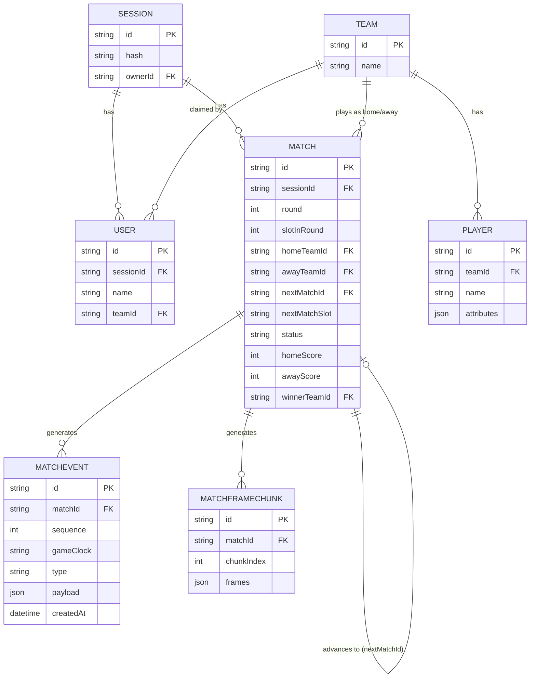
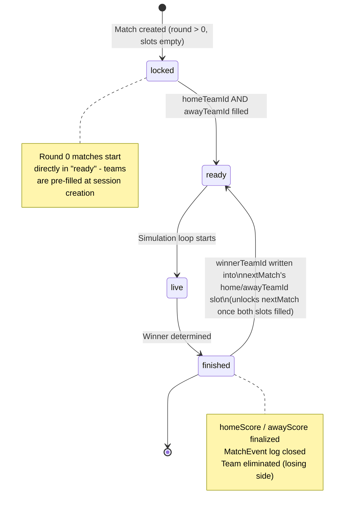
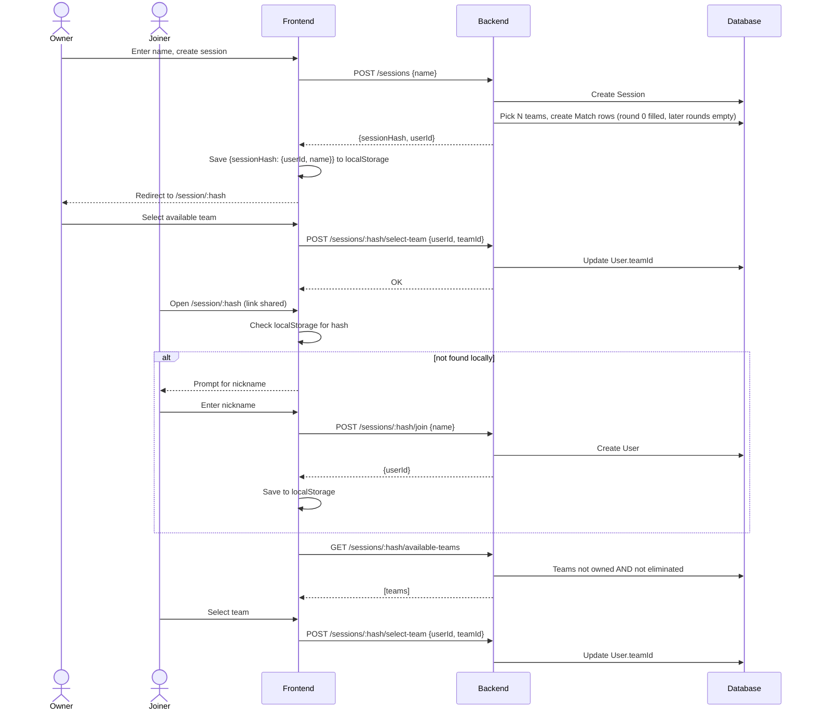
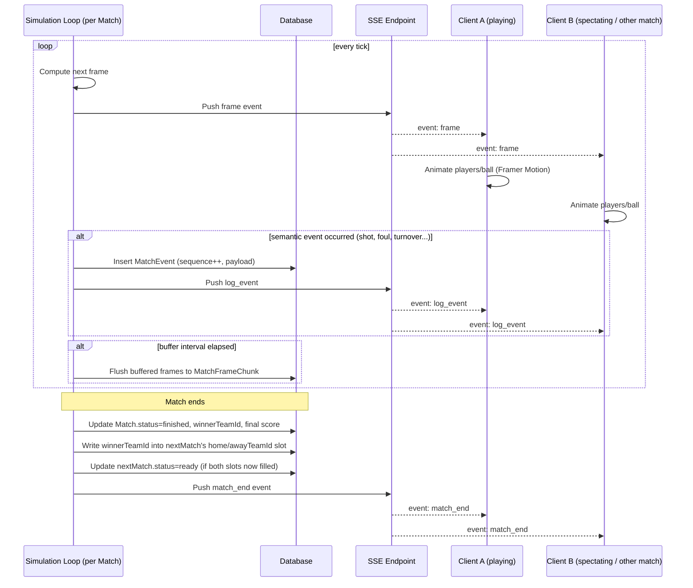

# Robô Cestinha — Solution Design

Planning artifact covering the data model, session/tournament mechanics, and streaming architecture for the multiplayer basketball tournament app.

---

## 1. Context

Current frontend (from handoff doc) is a Vite + React + TypeScript + Framer Motion visualization prototype:
- Renders an SVG basketball court.
- Animates 10 players + 1 ball using a mock engine that emits random frames.
- No real simulation, no backend, no persistence yet.

Target: a real multiplayer system where users create/join **sessions**, each session runs an 8-team single-elimination **tournament**, and matches are simulated server-side and streamed to clients live (plus replayable afterward).

### Pages (from wireframes)
- **Home Page** — entry point, menu.
- **Tournament Bracket Page** — 8 teams, single elimination, later rounds locked until earlier ones finish.
- **Team Selection Screen** — pick a team, view roster/stats, locked in after selection.
- **Match Screen** — live court, score, clock, log of plays, AI-generated commentary.

---

## 2. Core Concepts

- **Session** — one tournament instance, identified by a shareable hash in the URL. No login; identity is a lightweight per-browser record.
- **User** — a participant in a session (owner or joiner), identified by a nickname, optionally attached to a Team.
- **Team / Player** — global reference catalog (roster + stats), reused across sessions, not owned by a session.
- **Match** — one bracket slot. The full bracket tree is just the graph of Match rows linked via `nextMatchId`.
- **MatchEvent** — sparse, semantic events within a match (shots, fouls, possession changes) — drives the play log and commentary.
- **MatchFrameChunk** — dense, batched positional data — drives the animation, both live and on replay.

---

## 3. Data Model

### 3.1 Entity descriptions

**Session**
- `id`, `hash` (public identifier used in the URL), `ownerId`

**User**
- `id`, `sessionId`, `name`, `teamId` (nullable until a team is claimed)

**Team** (global catalog, not session-scoped — *open decision, see §6*)
- `id`, `name`

**Player** (global catalog)
- `id`, `teamId`, `name`, `attributes` (stats shown on the Team Selection screen)

**Match** — represents one bracket slot; the bracket tree itself, no separate Tournament table needed
- `id`, `sessionId`
- `round`, `slotInRound` — position in the bracket
- `homeTeamId`, `awayTeamId` — nullable until known
- `nextMatchId`, `nextMatchSlot` (`home`/`away`) — where the winner advances to
- `status` — `locked` / `ready` / `live` / `finished`
- `homeScore`, `awayScore` — denormalized, updated transactionally as scoring events land
- `winnerTeamId`

**MatchEvent** — one row per meaningful in-game moment
- `id`, `matchId`, `sequence` (monotonic, gapless), `gameClock`
- `type` — `possession_change` / `shot_attempt` / `shot_made` / `shot_missed` / `foul` / `turnover` / `substitution` / `quarter_start` / `quarter_end` / `game_start` / `game_end` / `commentary`
- `payload` (JSON, shape depends on `type`)
- `createdAt`

Generated AI commentary is stored as `type = commentary` in this same table — it shares sequencing/playback semantics with everything else, no separate table needed.

**MatchFrameChunk** — batched positional data for animation
- `id`, `matchId`, `chunkIndex`
- `frames` (JSON array, e.g. one chunk per simulated second): `{ t, players: [{ id, x, y }], ball: { x, y }, possessionPlayerId }`

Batching avoids one row per frame (thousands per match). If this outgrows Postgres, a chunk can become a pointer into blob storage without changing the API shape.

### 3.2 Why events and frames are split

| | MatchEvent | MatchFrameChunk |
|---|---|---|
| Purpose | play log, commentary | animation |
| Density | sparse (tens–hundreds/match) | dense (thousands/match) |
| Meaning | each row is human-readable | individual frames are meaningless alone |

Frame-level `possessionPlayerId` (needed every tick for rendering) is separate from the `possession_change` *event* (only logged when it's worth showing in the play log).

### 3.3 ER Diagram

---

## 4. Bracket Mechanics

### 4.1 Seeding at session creation
1. Pick N teams from the global catalog (random draw or fixed default set).
2. Create round-0 `Match` rows with `homeTeamId`/`awayTeamId` pre-filled and `status = ready`.
3. Create later-round `Match` rows with null team slots, wired together via `nextMatchId` / `nextMatchSlot`.

The owner's team pick is then just the same "claim an available team" flow every joiner uses — no special case.

### 4.2 Team availability (for late joiners)
A team is available if, derived from existing tables (no extra table needed):
1. It appears as `homeTeamId`/`awayTeamId` in one of the session's round-0 Matches.
2. No `User` in this session has claimed it (`sessionId` + `teamId` match).
3. It hasn't lost a finished Match (not on the losing side of any `Match` with `status = finished`).

Open question: once every team is owned or eliminated, a new joiner becomes spectator-only — worth stating explicitly.

### 4.3 Match status lifecycle

---

## 5. Session, Identity & Join Flow

### 5.1 Identity storage (no login)
- **URL** carries only the session hash — `/session/:hash`. Stays identity-free so it's safe to share.
- **localStorage** carries identity, keyed by session hash: `{ [sessionHash]: { userId, userName } }`.
- The same store powers the `/` page: a `recentSessions` list (`sessionHash`, `sessionName`, `userId`, `userName`, `teamId?`, `lastVisitedAt`) read locally, refreshed against the backend for live status.

Trade-off to keep explicit: with no login, `userId` is effectively a bearer credential for that session — acceptable given "no login" is a stated goal, but worth stating rather than leaving implicit.

### 5.2 Session creation & join sequence

---

## 6. Live Match Simulation & Streaming

### 6.1 Transport: SSE over WebSocket

Traffic is one-directional (server → client push of frames/events); team picks, joins, etc. are ordinary REST POSTs. SSE fits better:

| | SSE | WebSocket |
|---|---|---|
| Direction needed | server→client only | bidirectional |
| Reconnection | built into the browser (`EventSource` auto-retries) | build it yourself |
| Infra | plain HTTP, works through standard proxies/load balancers | needs upgrade handling, stickier infra |
| Debugging | inspectable like any HTTP response | needs dedicated tooling |

Reconsider only if client→server messaging during a live match gets added later (chat, reactions) — start with SSE, upgrade only the parts that need it.

### 6.2 Concurrency model
- Each live Match runs its own async simulation loop (one task/promise per match) on the backend.
- Matches don't share state, so no contention between concurrently running matches.
- Scaling past a single backend process (multiple instances) would need match-ownership routing (sticky routing or a lease per match) — not worth solving until it's an actual problem.

### 6.3 Live streaming sequence

### 6.4 One frame-source interface, two implementations
The existing frontend already has the right abstraction (`mockEngine → useGameFrames → App` = emit → buffer/pace → render). For the real system:
- **Live**: source = SSE stream.
- **Replay of a finished match**: source = fetch `MatchFrameChunk` rows in order.

The rendering layer shouldn't need to know which one it's getting.

---

## 7. Open Decisions

1. **Team/Player scope** — confirmed as a global catalog shared across sessions vs. per-session customization. Changes whether `Team` needs a `sessionId`.
2. **Reconnect/late join during a live match** — replay all buffered frames since match start, or join the live stream from "now" only?
3. **Simulation scheduling at scale** — one process per active match vs. a single scheduler ticking all active matches; matters once concurrent sessions grow.
4. **All-teams-claimed-or-eliminated** — confirm spectator-only fallback for a joiner arriving after every team is spoken for.