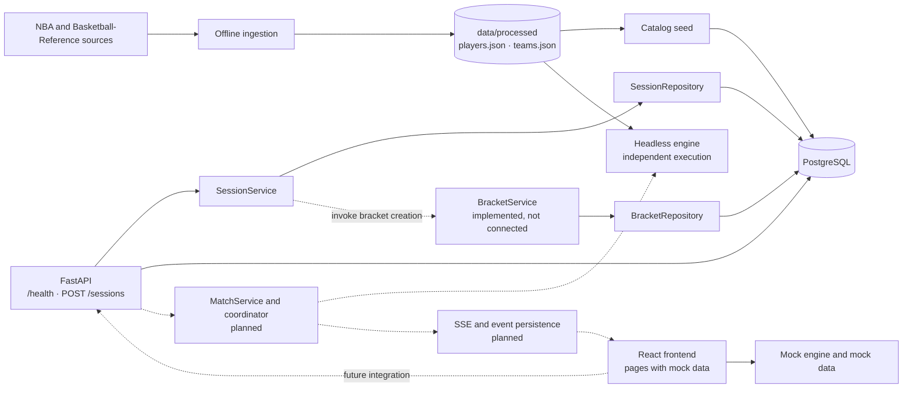
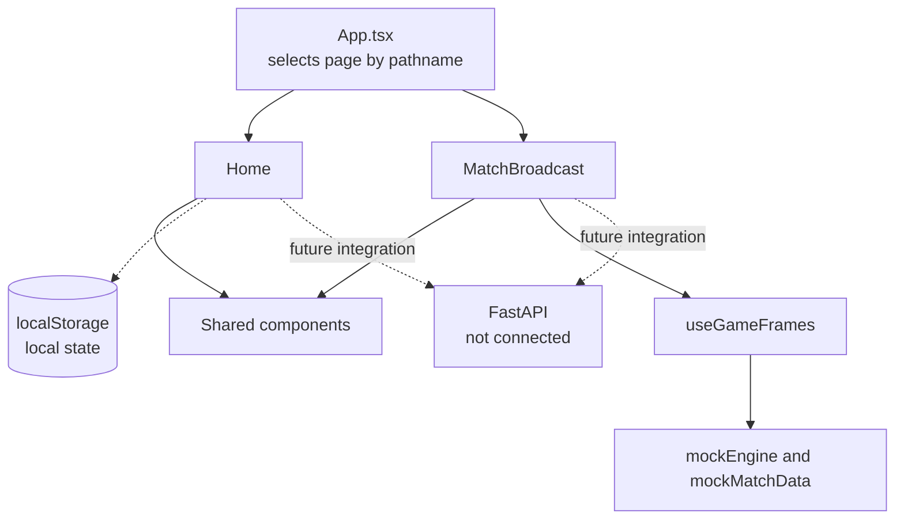
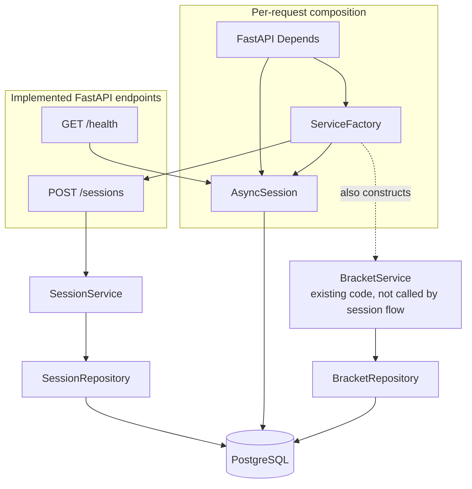
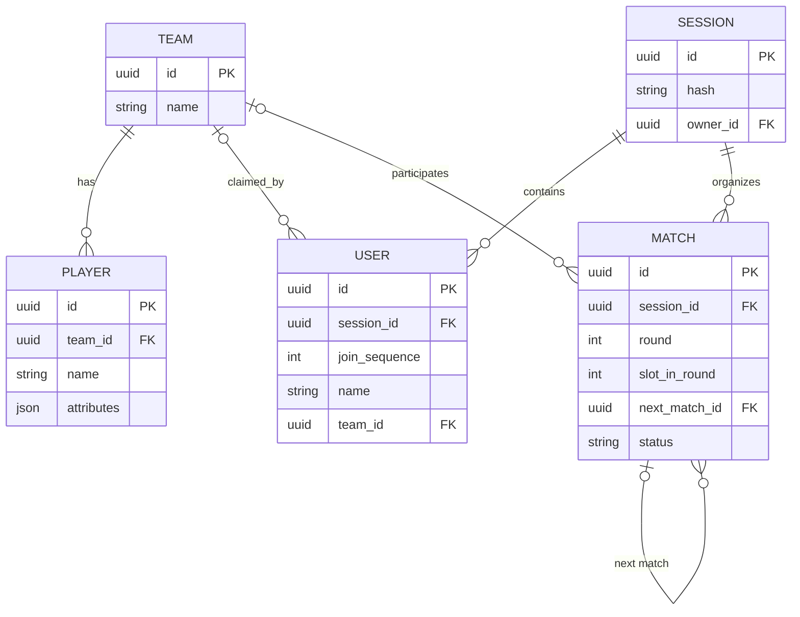
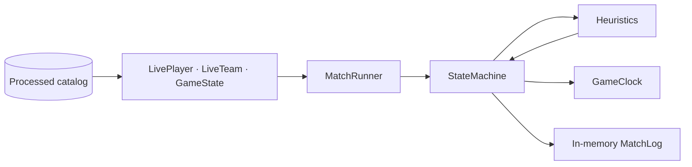
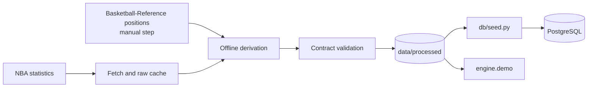

# Robô Cestinha Architecture

## Purpose and architecture status

This document describes the architecture currently implemented in the
repository and distinguishes it from planned flows. Solid arrows in the
diagrams represent existing integrations; dashed arrows represent future
integrations.

**Current status:** data ingestion prepares an offline catalog; the database
stores the catalog and sessions; the API provides a health check and session
creation; the engine runs an independent headless simulation; and the frontend
still uses mock data. These parts do not yet form an integrated broadcast flow.

## System overview

The engine reads processed data in an independent run; it is not invoked by the
API and does not query PostgreSQL during simulation. Ingestion and the seed
script are operational tasks outside request traffic.

## Frontend

- The frontend uses React, TypeScript, and Vite. `App.tsx` chooses between
  pages by checking `window.location.pathname`; there is no routing library
  yet.
- `Home` and `MatchBroadcast` render the interface, but their operations do not
  consume the API. The broadcast uses the mock engine and static match data.
- `useGameFrames` queues locally generated frames to animate the court. It
  does not consume SSE or replay persisted frames.
- Shared components handle presentation. The display name and other local data
  may use `localStorage`; this is not session state synchronized with the
  backend.

## Backend and persistence

- The current endpoints are `GET /health` and `POST /sessions`. The latter
  creates and persists a session and its owner user.
- `api/factories.py` is the composition point: `ServiceFactory` creates
  services and repositories using a request-scoped asynchronous SQLAlchemy
  session.
- Services coordinate domain operations; repositories encapsulate queries and
  persistence. `BaseRepository` centralizes shared session and transaction
  operations.
- `BracketService.seed_bracket_for_session()` and its repository are
  implemented, but `SessionService.create_session()` does not call that
  method. Therefore, the session-creation endpoint **does not create bracket
  matches** today. Describe this integration as future work until it is wired
  into the code.
- `core/` centralizes configuration and secrets. The intended backend
  dependency direction is API → domain → repositories → database; the engine
  and ingestion do not depend on session or HTTP concepts.

## Implemented data model

The current tables are `Team`, `Player`, `Session`, `User`, and `Match`.

`Match.next_match_id` references another row in the same table and can
represent bracket progression. The implementation does not yet have
`MatchEvent` or `MatchFrameChunk` table models; event persistence, frame
persistence, and replay remain planned.

## Patterns and responsibilities

- **Repository:** `SessionRepository` and `BracketRepository` encapsulate data
  access and share operations through `BaseRepository`.
- **Service Layer:** `SessionService` and `BracketService` coordinate domain
  workflows without directly receiving an `AsyncSession`.
- **Factory and Dependency Injection:** `ServiceFactory`, constructed by
  FastAPI per request, composes services and repositories with the database
  session.
- **State Machine:** `engine/state_machine.py` coordinates the states and
  actions of a possession.
- **Schemas as contracts:** Pydantic models describe processed data and engine
  results. They do not imply that an API or persistence flow for those results
  exists today.

## Simulation engine

The engine is headless and can be run using the demo. It uses catalog
attributes in probabilistic decisions: usage influences player selection;
turnover and steal rates influence turnovers; shooting percentages, fatigue,
and clutch influence shot outcomes. The random generator can be seeded to
reproduce a run.

The current scope is partial. The runner simulates four regulation periods;
although the clock understands overtime, tied games are not fully resolved
with overtime periods. Missed shots switch possession directly: a rebound
function exists, but the state machine does not call it. Fouls do not proceed
to free throws, and substitutions are not integrated into the loop. The
runner's result is an in-memory `MatchLog`, not persisted events or real-time
frames.

## Ingestion and catalog

The pipeline separates network fetching from offline derivation, validates the
results before writing processed files, and produces the catalog consumed by
the seed script and the engine's independent demo. It does not participate in
each API request.

## Future direction

The intended flow is to connect the interface to domain endpoints, complete
the session and bracket workflow, and have a coordinator service run the
engine. Match integration may persist appropriate data and send updates to the
interface over SSE. These components and the event/frame tables should not be
described as implemented until they exist in the code.
