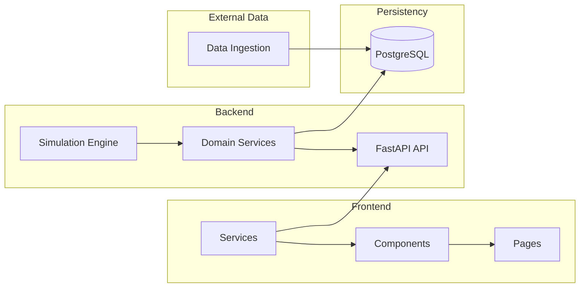
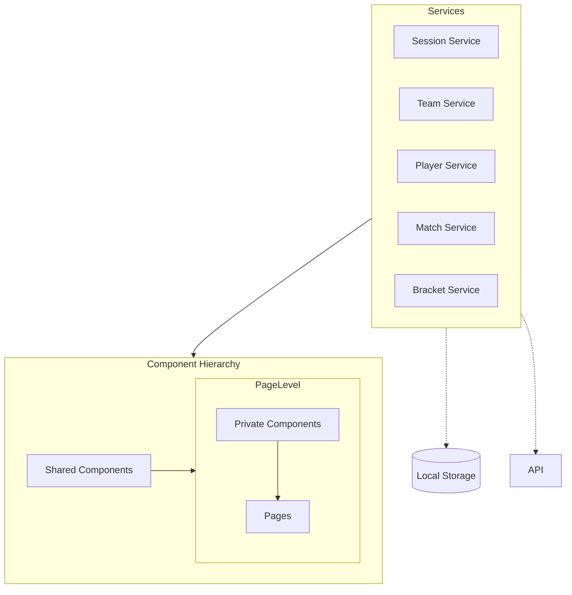
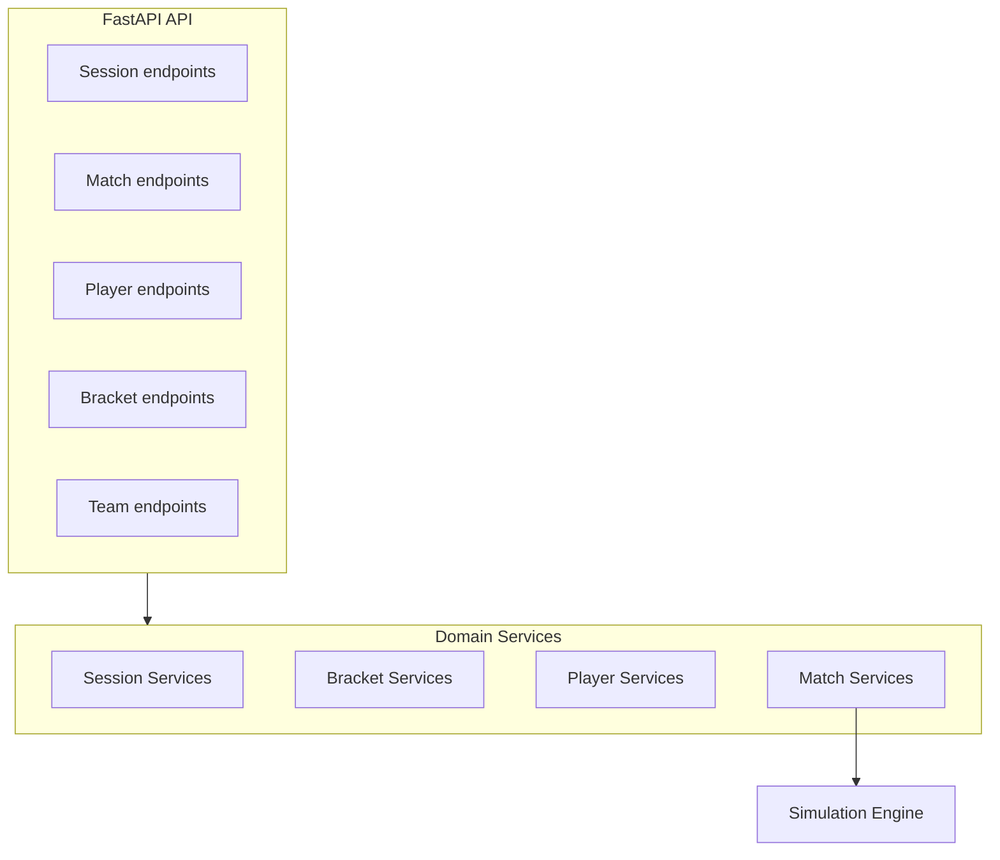

# Robô Cestinha Architecture

## Purpose

This document describes the target architecture: the main blocks, how they're organized internally, and how they connect.

## System Overview

Four blocks:
- **Frontend** — a React app; nothing here holds tournament rules, it renders what the backend returns and sends user actions back.
- **Backend** — a FastAPI app; owns every rule (sessions, brackets, teams, matches) and runs the match simulation.
- **Persistency** — PostgreSQL; the catalog (teams/players) and all session/match data.
- **External Data** — an offline, one-off job that prepares the catalog from external sources. Not part of live request traffic.

Frontend ↔ Backend traffic is REST for commands/queries, SSE for live match updates. WebSocket isn't needed unless the product later adds client→server messages during a live match.

## Frontend

- **Component Hierarchy** — Shared Components are generic, no data-fetching, used by more than one page. Page Level Components are page-private; a Private Component is promoted to Shared once more than one page needs it.
- **Services** — one per domain concern, mirroring the backend's Domain Services. They're what pages actually call; pages never fetch data or hold rules themselves.
- Services reach two different things depending on the data: **Local Storage** for device-only state (saved display name, recent sessions — never sent to the backend), and the **API** for everything else (REST + SSE).

## Backend

- **FastAPI API** — one endpoint group per concern. `api/` only parses requests and maps responses; no DB queries or rules live here.
- **Domain Services** — the actual rules (`domain/`). Team endpoints route to Player Services, which owns both the team catalog and roster reads — there's no separate Team Services module.
- **Simulation Engine** — possession state machine, clock, scoring. Has no knowledge of sessions, users, or HTTP. It's a dependency Match Services calls into, not the other way around — the other three domain services never touch it.
- `core/` (config + secrets) sits underneath all of the above, reachable from every layer — not drawn as its own node since every layer depends on it equally.

## Data Model

**Team** — global catalog, read-only at runtime.

| Field | Type | Notes |
|---|---|---|
| id | UUID | PK |
| name | string | |

**Player** — global catalog, belongs to a Team.

| Field | Type | Notes |
|---|---|---|
| id | UUID | PK |
| team_id | UUID | FK → Team.id |
| name | string | |
| attributes | JSON | stats blob |

**Session** — one tournament instance.

| Field | Type | Notes |
|---|---|---|
| id | UUID | PK |
| owner_id | UUID | FK → User.id, nullable |

**User** — a participant in a session.

| Field | Type | Notes |
|---|---|---|
| id | UUID | PK |
| session_id | UUID | FK → Session.id |
| join_sequence | integer | display number, per-session |
| name | string | duplicates allowed |
| team_id | UUID | FK → Team.id, nullable until claimed |

**Match** — one bracket slot; `next_match_id` self-links the bracket tree.

| Field | Type | Notes |
|---|---|---|
| id | UUID | PK |
| session_id | UUID | FK → Session.id |
| round | integer | |
| slot_in_round | integer | |
| home_team_id | UUID | FK → Team.id, nullable |
| away_team_id | UUID | FK → Team.id, nullable |
| next_match_id | UUID | FK → Match.id (self), nullable |
| next_match_slot | string | "home" \| "away", nullable |
| status | string | locked \| ready \| live \| finished |
| home_score | integer | |
| away_score | integer | |
| winner_team_id | UUID | FK → Team.id, nullable |

**MatchEvent** — sparse, semantic events; play log and future commentary.

| Field | Type | Notes |
|---|---|---|
| id | UUID | PK |
| match_id | UUID | FK → Match.id |
| sequence | integer | monotonic per match |
| game_clock | string | |
| type | string | shot_made, foul, commentary, etc. |
| payload | JSON | shape depends on type |
| created_at | timestamp | |

**MatchFrameChunk** — dense, batched positions; court animation and replay.

| Field | Type | Notes |
|---|---|---|
| id | UUID | PK |
| match_id | UUID | FK → Match.id |
| chunk_index | integer | ordering within match |
| frames | JSON | array of player/ball positions |

`Match.next_match_id` is self-referencing — the full bracket tree is just this table's rows linked together. `MatchEvent` and `MatchFrameChunk` are deliberately separate: different access patterns, shouldn't share a schema.
