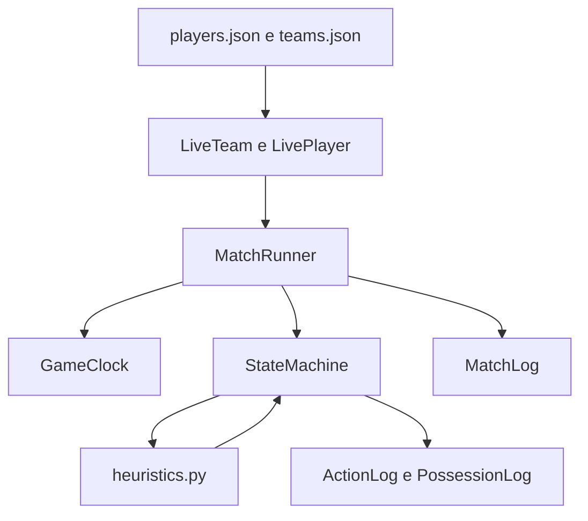

# Engine de simulação

Este guia explica, em português, como funciona cada bloco de
`backend/src/app/engine`. O engine é independente da API e do banco: ele
recebe modelos de times e jogadores, simula a partida em memória e devolve um
`MatchLog` estruturado.

## Visão geral do fluxo



O caminho principal é:

1. `demo.py` carrega e valida os arquivos processados.
2. `LiveTeam.from_team_and_players()` cria o estado mutável dos dois times.
3. `MatchRunner` prepara o relógio, a posse inicial e as posições.
4. Cada quarto chama `StateMachine.resolve_possession()` repetidamente.
5. A máquina escolhe ações por meio de `heuristics.py`, atualiza o relógio e
   registra os eventos.
6. Ao final dos quatro quartos, `MatchRunner` monta o `MatchLog`.

## `clock.py`: controle do tempo

`GameClock` possui dois contadores:

- `game_clock_remaining`: tempo restante no quarto;
- `shot_clock_remaining`: tempo restante da posse.

Exemplo:

```python
clock = GameClock()
clock.reset_for_new_possession()
elapsed, violation = clock.tick(3.5)
print(elapsed, clock.formatted_time(), violation)
# 3.5 11:56 False
```

`tick()` nunca consome mais tempo do que o quarto ou a posse permitem. Se o
relógio de posse chegar a zero antes do quarto, ele retorna `violation=True`.
`reset_for_new_possession(is_offensive_rebound=True)` usa 14 segundos; em uma
posse nova comum, usa 24 segundos.

## `grid.py`: quadra discreta

A quadra é uma matriz de 10 colunas por 5 linhas. `CourtPosition` limita
automaticamente qualquer coordenada ao intervalo válido:

```python
pos = CourtPosition(9, 2)
nova_pos = pos.move(Direction.E)
assert nova_pos == CourtPosition(9, 2)  # não sai da quadra
```

`RIM_A` fica em `(0, 2)` e `RIM_B` em `(9, 2)`. O time A ataca a cesta B e o
time B ataca a cesta A. `is_three_pointer()` compara a distância euclidiana
até a cesta-alvo com `THREE_POINT_DISTANCE_THRESHOLD`.

## `entities.py`: estado vivo da partida

`LivePlayer` é a versão mutável de um jogador do catálogo. Além dos atributos
originais, guarda stamina, posição, faltas e box score. Cada posse chama
`record_minutes()`, que soma segundos jogados e reduz a stamina.

`LiveTeam` organiza os jogadores em `players`, `on_court` e `bench`. A fábrica
seleciona até cinco titulares marcados; se houver menos de cinco, completa com
os próximos jogadores do elenco. `select_ball_handler()` escolhe o condutor
ponderando `usage_rate`.

`GameState` conecta os dois times, o relógio e a posse atual. As propriedades
`attacking_team` e `defending_team` evitam duplicar essa decisão em cada ação.
`flip_possession()` troca ataque e defesa, limpa o passador anterior e reinicia
o relógio de posse.

## `heuristics.py`: decisões probabilísticas

As funções deste módulo não controlam o fluxo da partida; elas respondem a
perguntas pontuais da máquina de estados:

| Função | Responsabilidade |
| --- | --- |
| `decide_handler_action` | Escolher passe, movimento ou arremesso. |
| `resolve_pass_teammate` | Selecionar o recebedor. |
| `resolve_pass_outcome` | Calcular se o passe foi interceptado. |
| `decide_move_direction` | Escolher uma direção, favorecendo a cesta adversária. |
| `resolve_move_outcome` | Resolver sucesso, desarme, falta ou retenção. |
| `resolve_shot` | Calcular cesta de dois/três pontos, fadiga e clutch. |
| `resolve_rebound` | Sortear um rebote entre os dez jogadores. |

O mesmo `random.Random` é passado por todas as funções. Assim, uma semente
fixa torna a simulação reproduzível:

```python
runner_a = MatchRunner(home_team, away_team, seed=123)
log_a = runner_a.run_match()
# Com os mesmos dados e seed, a sequência de sorteios é repetível.
```

## `state_machine.py`: uma posse

`StateMachine.resolve_possession()` executa este ciclo:

1. garante que exista um condutor;
2. escolhe uma ação;
3. resolve a ação usando uma heurística;
4. registra o resultado em `ActionLog`;
5. consome o tempo da ação;
6. encerra a posse em cesta, erro, violação ou fim do quarto.

Um passe bem-sucedido troca `active_handler_id`. Um passe interceptado ou um
desarme chama `flip_possession()`. Um arremesso convertido soma pontos ao time;
um arremesso errado também troca a posse, pois o rebote ainda é simplificado
nesta versão.

Exemplo de log de uma posse:

```python
PossessionLog(
    possession_id=0,
    team="lal",
    actions=[
        ActionLog(type="PASS", player="p1", target_player="p2", result="success"),
        ActionLog(type="SHOOT", player="p2", shot_type="2pt", result="made", points=2),
    ],
    outcome="made",
    points=2,
)
```

## `match_runner.py`: partida completa

`MatchRunner.__init__()` monta o `GameState`, cria o gerador aleatório e
posiciona os dez jogadores. `run_match()` percorre quatro quartos; em cada
posse, registra o log e atualiza a fadiga dos jogadores. Ao fim de cada quarto,
salva o placar e reinicia o relógio e as faltas coletivas.

O resultado é um `MatchLog` com identificadores dos times, vencedor, placar
final e uma lista de `QuarterLog`. O box score e os momentos-chave já fazem
parte do contrato, mas ainda não são preenchidos pelo fluxo atual.

## `schemas.py`: contrato dos logs

Os modelos Pydantic descrevem a saída serializável:

```text
MatchLog
  +- QuarterLog[]
  |    +- PossessionLog[]
  |         +- ActionLog[]
  +- FinalScore
  +- TeamBoxScore[]
```

`ActionLog` é o evento menor; `PossessionLog` agrupa eventos; `QuarterLog`
agrupa posses; `MatchLog` agrupa a partida inteira. `PlayerBoxScore`,
`TeamBoxScore`, `KeyMoment` e `FinalScore` completam o contrato para futuras
visualizações, narração e persistência.

## Demos

Para executar a demonstração textual a partir de `backend`, use:

```bash
PYTHONPATH=src python -m app.engine.demo
```

Ela carrega Lakers e Celtics, executa a partida e imprime placar e número de
posses. A demonstração visual usa a mesma preparação, mostra uma quadra ASCII
após cada ação e espera `y/n`:

```bash
PYTHONPATH=src python -m app.engine.visual_demo
```

## Limites atuais

- O runner executa quatro quartos, mas ainda não cria prorrogação quando há
  empate.
- O arremesso errado troca a posse diretamente; a função de rebote existe,
  mas ainda não está conectada à máquina de estados.
- Faltas, box scores detalhados e assistências ainda não são atualizados em
  todas as ações.
- O engine não acessa API, sessão de usuário ou banco de dados.